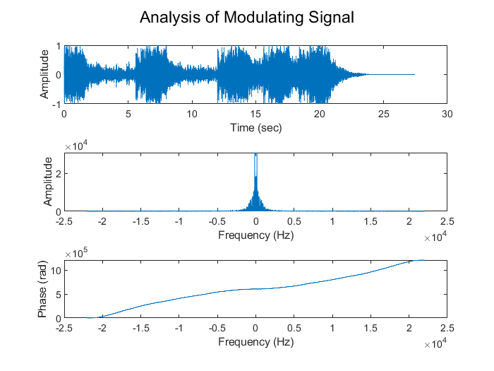
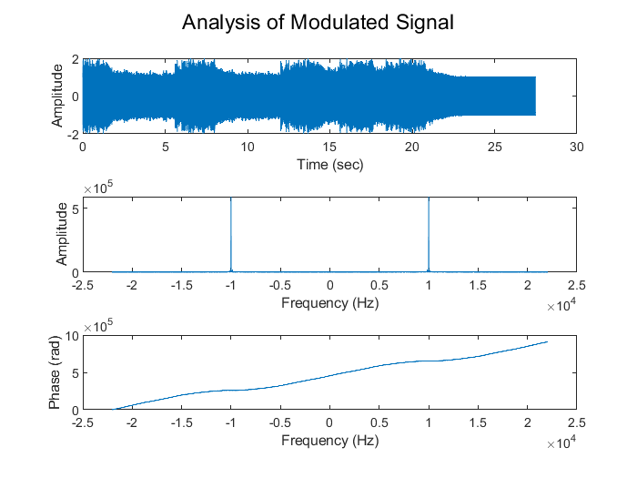
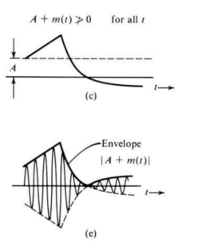
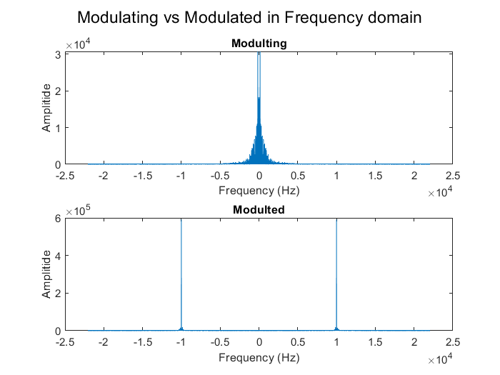
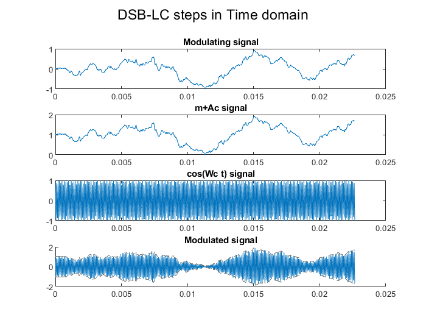
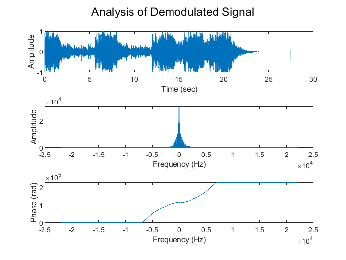
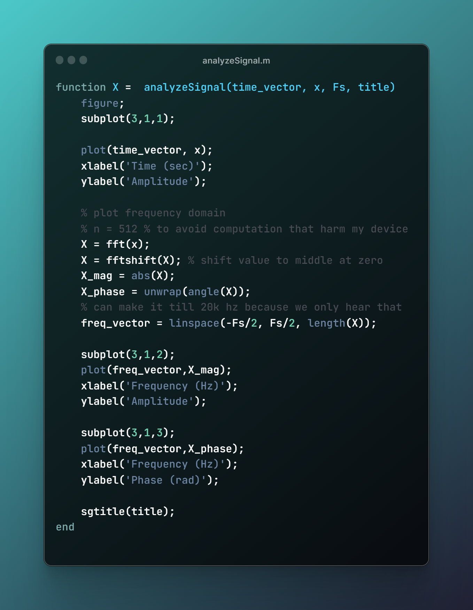
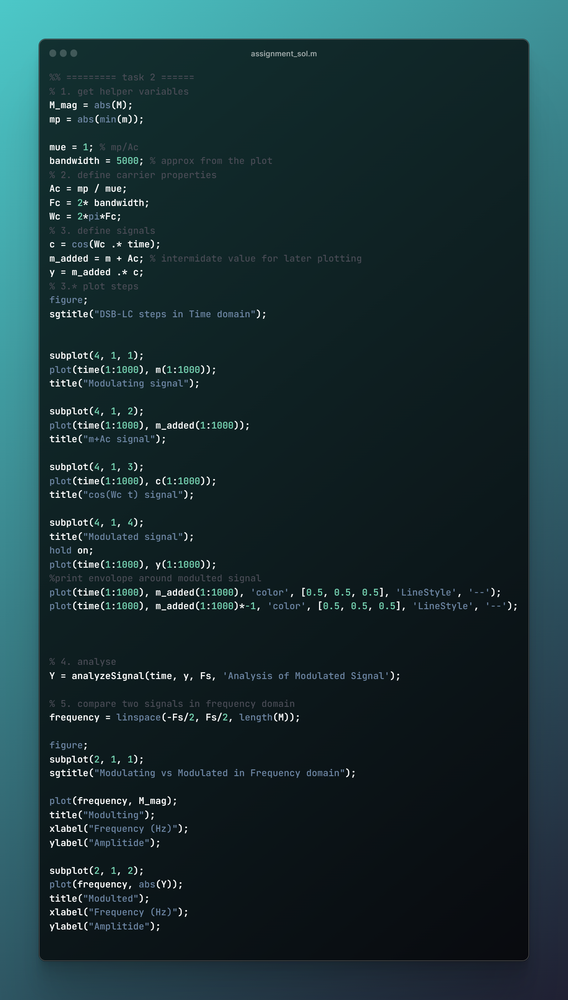
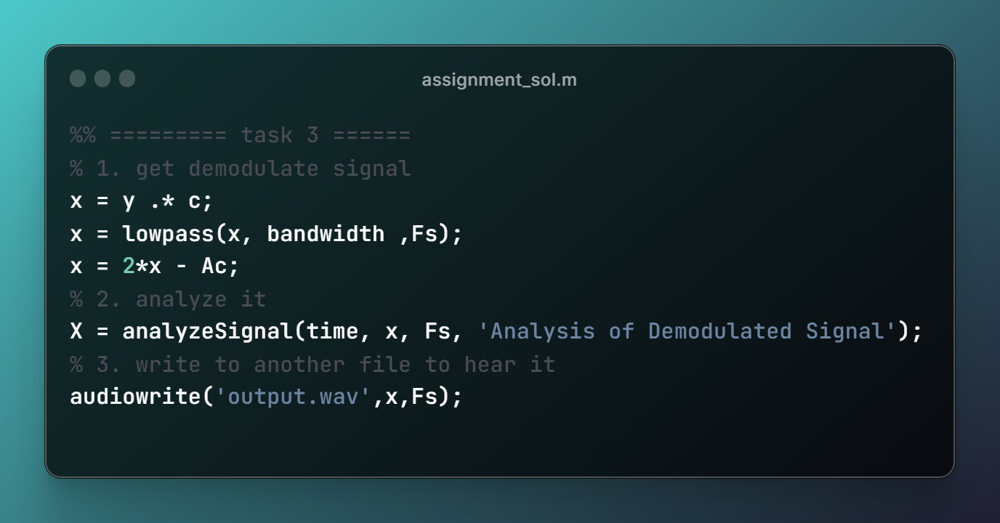

# Amplitude Modulation (DSB-LC)

**attachment**: [lab files](https://drive.google.com/drive/folders/1tRcSAtlDv4AF7TGCr-5ckqdXlKO9ZUR0?usp=sharing)

# 1. Analyse Audio

# 2. Perform DSB-LC Modulation

1. Choose reasonable values for **𝐴** and **𝜔** to achieve DSB-LC modulation with your
previous audio signal and explain how you choose them?
    - for choosing $**Fc$   ⇒ $w_c=2.\pi.F_c$**
        - from first plot (signal in frequency domain)   ⇒ $\text{bandwidth} \approx 5000 \text{ hz}$
        - from variables in code ⇒ $F_s = 44100 \text{ hz}$  ⇒ $\frac{F_s}{2} = 22050\text{ hz}$
        - $\text{bandwidth} \lt F_c \lt \frac{F_s}{2}$
        - $F_c = 2*\text{bandwidth} = 10000 \lt \frac{Fs}{2}$
        - usually it more than 2  *for antenna and other reasons*
    - for choosing $A_c$
        
        let   $\mu = 1$      so     $\therefore \eta = 33.33\%$       &        $\therefore  A_c = \frac{|min(m(t))|}{\mu} \approx 1$ 
        
2. Plot the modulated signal waveform in time domain and the modulated signal
amplitude and phase in frequency domain.
    
    
    
3. What do you think is a carrier’s minimum Amplitude (A) to avoid over
modulation? What is the problem with the AM signal when it is over-modulated?
    - $A_c \gt |\text{minimum }m(t)|$
    - so all signal become above access and when modulated I can extract envelope easily first by my eye then by a simple cheap circuit
    - if the signal toggle between negative and positive x-axis **we won’t able to know modulating signal from envelope**
        
        
        
4. Compare between the bandwidth of the audio signal and the modulated one by
plotting both signal in the frequency domain.
    
    ***comment***: 
    
    - it’s clear that **amplitude have peaks at  $F_c$ & $-F_c$**
    - and **bandwidth** of modulated signal is **double** modulating signal  *not clear in plot*
    - modulated its mirror (even) because modulating signal is real
    
    
    

### Bonus: steps of DSB-LC modulated signal in time domain

# 3. Perform DSB-LC Demodulation

1. Do synchronous demodulation to obtain 𝑥(𝑡) , then plot the final signal in time
and frequency domain as previous.
    
    
    
2. Hear the demodulated signal and compare it with the original one.
Are the two signals the same? Explain why?
    
    ***comment:***
    
    😲 they Hear the same (for left channel *as I removed right channel to ease calculations)
    
    **small change in phase** :  I think it may be the Low pass filter function because after all I approximate bandwidth by my eye
    
    why: 
    
    - carrier signal used in modulation and demodulation process is the same we know exactly $\phi_c$, $A_c$, $w_c$
    - achieve max power efficiency $33\%$

# Code

## 📊 Utility function to make it easy to analyse signals

## 🎵 Task 1: read audio file and analyse it

## 📡 Task 2: DSB-LC Modulation

## 📻 Task 3: DSB-LC Demodulating

